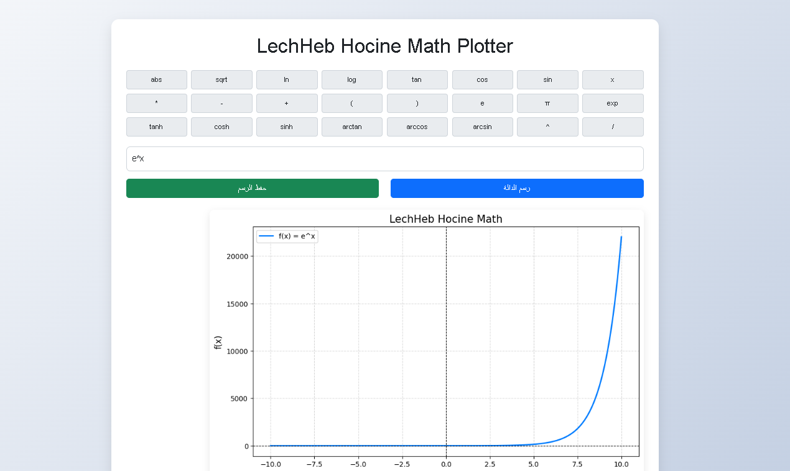
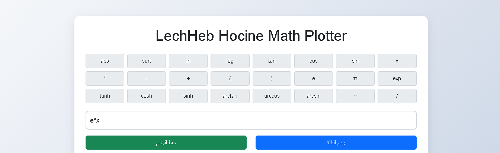
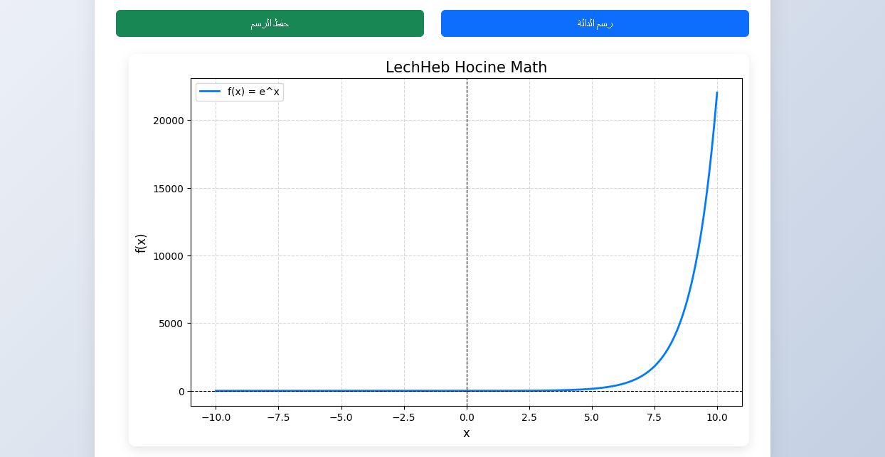

# Lecheheb Hocine Math Plotter 📊🧮

## Overview
A powerful, user-friendly web application for plotting mathematical functions with an intuitive Arabic-friendly interface.



## 🚀 Features
- Interactive mathematical function plotter
- Comprehensive mathematical keyboard
- Support for multiple mathematical functions
- Responsive Arabic-first design
- Easy graph saving functionality

## 🛠 Technologies Used
- Python (Flask)
- Matplotlib
- JavaScript
- Bootstrap

## 📦 Installation

### Prerequisites
- Python 3.8+
- pip

### Setup
1. Clone the repository:
```bash
git clone https://github.com/yourusername/math-graph-plotter.git
cd math-graph-plotter
```

2. Create virtual environment:
```bash
python -m venv venv
source venv/bin/activate  # On Windows use `venv\Scripts\activate`
```

3. Install dependencies:
```bash
pip install -r requirements.txt
```

4. Run the application:
```bash
python app.py
```

## 🎯 Usage
- Enter mathematical functions
- Use built-in mathematical keyboard
- Click "Plot Graph" to visualize
- Save graph with dedicated button

## 📝 Supported Functions
- Trigonometric: sin, cos, tan
- Logarithmic: log, ln
- Exponential: exp
- Algebraic: sqrt, abs
- Hyperbolic: sinh, cosh, tanh

## 🤝 Contribution
1. Fork the repository
2. Create your feature branch
3. Commit changes
4. Push to the branch
5. Create pull request

## 👨‍💻 Author
**Lecheheb Hocine**
- GitHub: [@LechehebDjaafar](github.com/lechehebdjaafar)
## 📄 License
This project is licensed under the MIT License

## 🖼 Screenshots



## 🌟 Support
Star this repository if you find it useful!